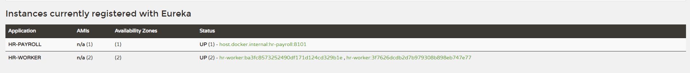

# 2.4 Random port para hr-worker

`server.port=${PORT:0}` no hr-worker: a porta `0` diz pro Spring Boot escolher uma porta livre aleatória do sistema operacional a cada vez que a aplicação sobe, em vez de usar sempre a 8001 fixa. Isso é o que permite rodar várias instâncias do hr-worker ao mesmo tempo, cada uma numa porta diferente, sem conflito.

Como agora várias instâncias compartilham o mesmo nome (`hr-worker`) e portas variam a cada subida, foi preciso deixar o registro no Eureka único por instância: `eureka.instance.instance-id=${spring.application.name}:${spring.application.instance_id:${random.value}}` adiciona um valor aleatório no id, garantindo que cada instância apareça separada no Eureka em vez de se sobrepor.

Confirmado no dashboard do Eureka (`localhost:8761`): rodando duas instâncias do hr-worker ao mesmo tempo, as duas aparecem registradas separadamente sob HR-WORKER, cada uma com seu próprio id.

---

#### English

`server.port=${PORT:0}` in hr-worker: port `0` tells Spring Boot to pick a random free operating system port every time the application starts, instead of always using the fixed 8001. This is what allows running multiple hr-worker instances at the same time, each on a different port, without conflict.

Since multiple instances now share the same name (`hr-worker`) and ports vary on every startup, the Eureka registration needed to be made unique per instance: `eureka.instance.instance-id=${spring.application.name}:${spring.application.instance_id:${random.value}}` adds a random value to the id, guaranteeing each instance shows up separately in Eureka instead of overlapping.

Confirmed on Eureka's dashboard (`localhost:8761`): running two hr-worker instances at the same time, both show up registered separately under HR-WORKER, each with its own id (see image above).
