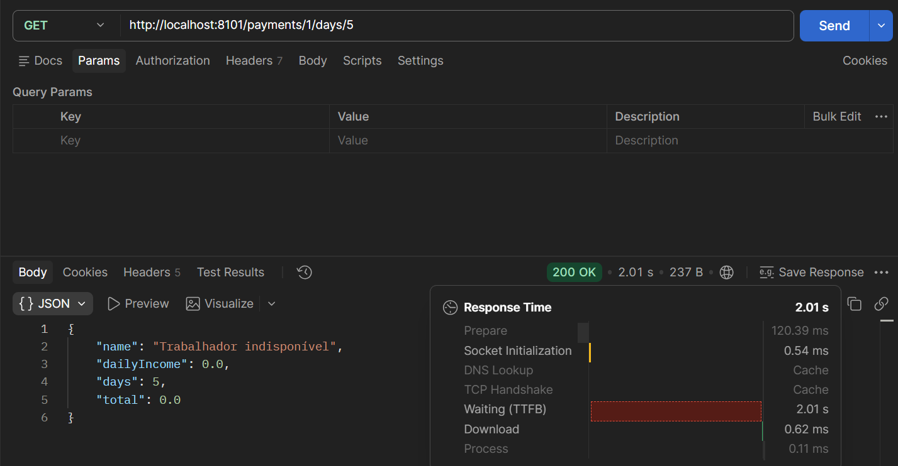

# 2.5 Tolerância a falhas com Hystrix

Dependência `spring-cloud-starter-netflix-hystrix` adicionada ao hr-payroll e `@EnableCircuitBreaker` na classe principal, habilitando o circuit breaker.

`@HystrixCommand(fallbackMethod = "getPaymentAlternative", ignoreExceptions = {ResourceNotFoundException.class})` no `PaymentService.getPayment`, que é onde a chamada arriscada de verdade acontece (via Feign pro hr-worker). O fallback `getPaymentAlternative` fica na mesma classe e com a mesma assinatura do método original, devolvendo um `Payment` mockado quando a chamada falha.

O fallback cobre qualquer falha real na chamada ao hr-worker: timeout, hr-worker fora do ar (conexão recusada), erro 500, ou repetição de falhas seguidas abrindo o circuit breaker (nesse caso o Hystrix nem tenta chamar de novo, vai direto pro fallback por um tempo). `ignoreExceptions = {ResourceNotFoundException.class}` é a exceção a essa regra: sem ela, um 404 real (lançado de propósito quando o worker não existe) também cairia no fallback e viraria silenciosamente uma resposta "de sucesso" com dado mockado, escondendo o erro verdadeiro. Com `ignoreExceptions`, o 404 intencional continua sendo um 404 real pro cliente, e só falha de infraestrutura de verdade aciona o mock.

Timeouts configurados (`hystrix.command.default.execution.isolation.thread.timeoutInMilliseconds=60000`, `ribbon.ConnectTimeout=10000`, `ribbon.ReadTimeout=20000`), necessários porque o timeout padrão do Hystrix é de só 1 segundo: qualquer chamada real um pouco mais lenta dispararia o fallback sem ter falhado de verdade.

Fallback testado na prática: `Thread.sleep(3000L)` descomentado em `WorkerService.findById` (hr-worker) e timeout do Hystrix baixado pra 2000ms só pro teste, forçando o timeout estourar antes da resposta do hr-worker chegar. GET `localhost:8101/payments/1/days/5` no Postman retornou 200 OK em 2.01s com `{"name": "Trabalhador indisponível", "dailyIncome": 0.0, "days": 5, "total": 0.0}` — o fallback disparou de verdade, sem quebrar o contrato da API pro cliente.

---

#### English

`spring-cloud-starter-netflix-hystrix` dependency added to hr-payroll and `@EnableCircuitBreaker` on the main class, enabling the circuit breaker.

`@HystrixCommand(fallbackMethod = "getPaymentAlternative", ignoreExceptions = {ResourceNotFoundException.class})` on `PaymentService.getPayment`, which is where the actual risky call happens (via Feign to hr-worker). The fallback `getPaymentAlternative` lives in the same class with the same signature as the original method, returning a mocked `Payment` when the call fails.

The fallback covers any real failure calling hr-worker: timeout, hr-worker being down (connection refused), a 500 error, or repeated failures in a row opening the circuit breaker (in that case Hystrix does not even try calling again, it goes straight to the fallback for a while). `ignoreExceptions = {ResourceNotFoundException.class}` is the exception to that rule: without it, a real 404 (thrown on purpose when the worker does not exist) would also fall back and silently turn into a "successful" response with mocked data, hiding the real error. With `ignoreExceptions`, an intentional 404 stays a real 404 for the client, and only a real infrastructure failure triggers the mock.

Timeouts configured (`hystrix.command.default.execution.isolation.thread.timeoutInMilliseconds=60000`, `ribbon.ConnectTimeout=10000`, `ribbon.ReadTimeout=20000`), needed because Hystrix's default timeout is only 1 second: any real call that is a bit slower would trigger the fallback without having actually failed.

Fallback tested in practice: `Thread.sleep(3000L)` uncommented in `WorkerService.findById` (hr-worker) and Hystrix's timeout lowered to 2000ms just for the test, forcing the timeout to fire before the hr-worker response arrives. GET `localhost:8101/payments/1/days/5` in Postman returned 200 OK in 2.01s with `{"name": "Trabalhador indisponível", "dailyIncome": 0.0, "days": 5, "total": 0.0}` — the fallback actually fired, without breaking the API contract for the client.

