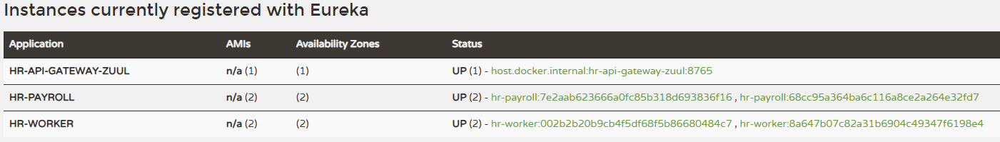

# 2.9 Random port para hr-payroll

Mesmo ajuste já feito no hr-worker na aula 2.4, agora aplicado no hr-payroll.

`server.port=${PORT:0}` no lugar da porta fixa 8101: o `0` faz o Spring Boot pedir ao sistema operacional uma porta livre qualquer a cada subida, e o `${PORT:...}` mantém a possibilidade de fixar a porta por variável de ambiente quando precisar. Isso é o que permite subir várias instâncias do hr-payroll ao mesmo tempo sem conflito de porta.

`eureka.instance.instance-id=${spring.application.name}:${spring.application.instance_id:${random.value}}` é a consequência disso: como as instâncias compartilham o mesmo `spring.application.name` (`hr-payroll`), sem um id único elas se sobreporiam no registro do Eureka e só uma apareceria. O `${random.value}` garante um id diferente por instância, então cada uma aparece separada sob HR-PAYROLL no dashboard.

Perder a porta fixa não quebra o acesso ao serviço porque nada mais depende dela: o cliente chama o gateway em `localhost:8765/hr-payroll/**`, e o Zuul resolve o endereço real pelo nome registrado no Eureka. O Ribbon, que já balanceava as chamadas do hr-payroll pro hr-worker, agora também balanceia as chamadas que chegam do gateway entre as instâncias do hr-payroll.

Confirmado no dashboard do Eureka (`localhost:8761`): duas instâncias do hr-payroll rodando ao mesmo tempo aparecem registradas separadamente sob HR-PAYROLL, cada uma com seu próprio id. Na mesma tela, HR-WORKER também com duas instâncias e o gateway registrado sob HR-API-GATEWAY-ZUUL, ou seja, o sistema inteiro subindo junto.

---

#### English

Same change already made in hr-worker in lesson 2.4, now applied to hr-payroll.

`server.port=${PORT:0}` in place of the fixed port 8101: the `0` makes Spring Boot ask the operating system for any free port on every startup, and `${PORT:...}` keeps the option of pinning the port through an environment variable when needed. This is what allows running several hr-payroll instances at the same time without a port conflict.

`eureka.instance.instance-id=${spring.application.name}:${spring.application.instance_id:${random.value}}` follows from that: since the instances share the same `spring.application.name` (`hr-payroll`), without a unique id they would overlap in the Eureka registry and only one would show up. The `${random.value}` guarantees a different id per instance, so each one appears separately under HR-PAYROLL on the dashboard.

Losing the fixed port does not break access to the service because nothing depends on it any more: the client calls the gateway at `localhost:8765/hr-payroll/**`, and Zuul resolves the real address by the name registered in Eureka. Ribbon, which already load balanced the calls from hr-payroll to hr-worker, now also load balances the calls coming from the gateway between the hr-payroll instances.

Confirmed on Eureka's dashboard (`localhost:8761`): two hr-payroll instances running at the same time show up registered separately under HR-PAYROLL, each with its own id. On the same screen, HR-WORKER also has two instances and the gateway is registered under HR-API-GATEWAY-ZUUL, meaning the whole system is up together.

