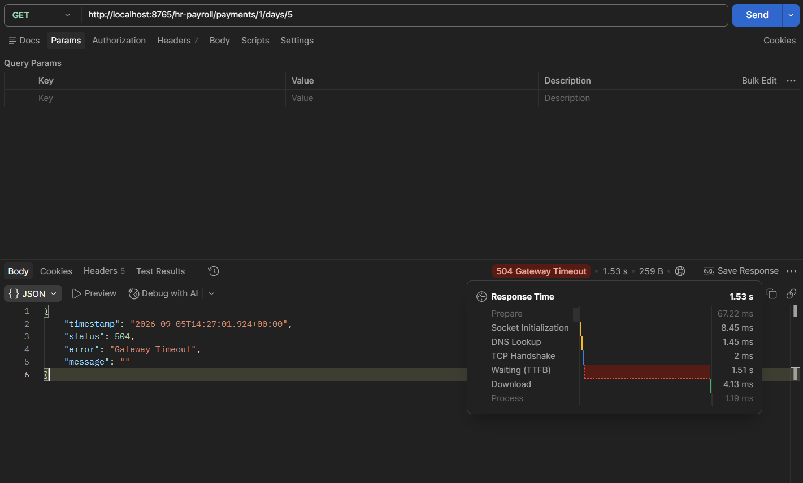
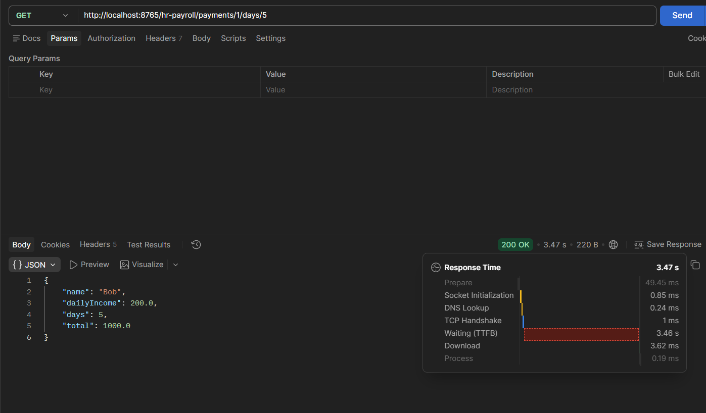
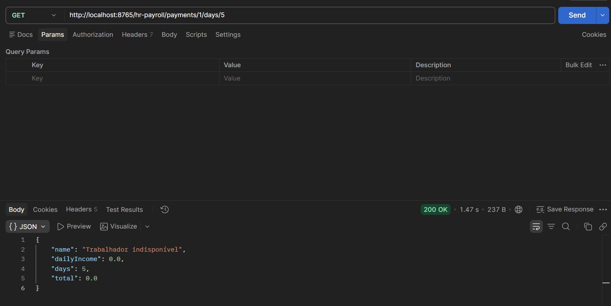

# 2.10 Zuul timeout

Mesmo com Hystrix e Ribbon configurados dentro de um microsserviço, se o Zuul não tiver o timeout dele configurado, para o Zuul aquilo continua sendo um problema de timeout: ele corta a chamada antes e devolve erro pro cliente, sem nem esperar o microsserviço responder. Por isso o timeout precisa ser configurado também no Zuul.

E quando o timeout está configurado só no Zuul (e não no microsserviço), quem estoura primeiro é o Hystrix do microsserviço, que chama o método alternativo dele. O gateway, com timeout folgado, entrega essa resposta do fallback normalmente.

As mesmas três propriedades já usadas no hr-payroll foram adicionadas no hr-zuul-server:

```properties
hystrix.command.default.execution.isolation.thread.timeoutInMilliseconds=60000
ribbon.ConnectTimeout=10000
ribbon.ReadTimeout=20000
```

Elas são necessárias porque o Zuul não é um proxy "burro": ele roteia usando Ribbon e envolve cada encaminhamento num comando Hystrix, então herda os mesmos defaults apertados (1 segundo no Hystrix), que precisam ser afrouxados no gateway igual foram no microsserviço.

Testes feitos com `Thread.sleep(3000L)` descomentado no `WorkerService.findById` (hr-worker), pra forçar a chamada a demorar 3 segundos, sempre em GET `localhost:8765/hr-payroll/payments/1/days/5`, ou seja, passando pelo gateway.

**Antes de configurar o timeout no Zuul:** 504 Gateway Timeout em 1.53s. O hr-payroll estava com os 60 segundos de Hystrix configurados e teria respondido bem, mas o Zuul cortou a chamada no default de ~1 segundo dele. O erro nem vem do microsserviço, vem do gateway.



**Depois de configurar o timeout no Zuul:** 200 OK em 3.47s com o dado real (`{"name": "Bob", "dailyIncome": 200.0, "days": 5, "total": 1000.0}`). Os 3 segundos do `sleep` agora cabem dentro do timeout tanto do gateway quanto do hr-payroll, então a resposta verdadeira chega até o cliente.



**Com o timeout configurado só no Zuul:** comentando as três propriedades de timeout do hr-payroll e mantendo as do gateway, a mesma chamada retornou 200 OK em 1.47s com o mock do fallback (`{"name": "Trabalhador indisponivel", "dailyIncome": 0.0, "days": 5, "total": 0.0}`). O hr-payroll voltou pro default de 1 segundo do Hystrix, estourou antes dos 3 segundos do hr-worker e chamou o `getPaymentAlternative`. O gateway, com timeout folgado, não cortou nada: só repassou a resposta do fallback como uma resposta normal de sucesso.



Os três casos juntos mostram a ordem: quem tem o timeout mais curto no caminho é quem decide o resultado. Timeout curto no gateway vira 504 e o cliente perde a resposta. Timeout curto no microsserviço vira fallback do Hystrix, que ainda é uma resposta útil. Timeout folgado nos dois deixa a chamada real completar.

---

#### English

Even with Hystrix and Ribbon configured inside a microservice, if Zuul does not have its own timeout configured, for Zuul that is still a timeout problem: it cuts the call short and returns an error to the client, without even waiting for the microservice to answer. That is why the timeout has to be configured in Zuul as well.

And when the timeout is configured only in Zuul (and not in the microservice), the one firing first is the microservice's Hystrix, which calls its alternative method. The gateway, with a generous timeout, forwards that fallback response normally.

The same three properties already used in hr-payroll were added to hr-zuul-server:

```properties
hystrix.command.default.execution.isolation.thread.timeoutInMilliseconds=60000
ribbon.ConnectTimeout=10000
ribbon.ReadTimeout=20000
```

They are needed because Zuul is not a "dumb" proxy: it routes using Ribbon and wraps each forward in a Hystrix command, so it inherits the same tight defaults (1 second on Hystrix), which have to be loosened on the gateway just like they were on the microservice.

Tests done with `Thread.sleep(3000L)` uncommented in `WorkerService.findById` (hr-worker), to force the call to take 3 seconds, always on GET `localhost:8765/hr-payroll/payments/1/days/5`, that is, going through the gateway.

**Before configuring the timeout in Zuul:** 504 Gateway Timeout in 1.53s. hr-payroll had its 60 second Hystrix timeout configured and would have answered fine, but Zuul cut the call at its own default of about 1 second. The error does not even come from the microservice, it comes from the gateway.


**After configuring the timeout in Zuul:** 200 OK in 3.47s with the real data (`{"name": "Bob", "dailyIncome": 200.0, "days": 5, "total": 1000.0}`). The 3 seconds of the `sleep` now fit inside the timeout of both the gateway and hr-payroll, so the true response reaches the client.


**With the timeout configured only in Zuul:** commenting out hr-payroll's three timeout properties and keeping the gateway's, the same call returned 200 OK in 1.47s with the fallback mock (`{"name": "Trabalhador indisponivel", "dailyIncome": 0.0, "days": 5, "total": 0.0}`). hr-payroll went back to Hystrix's 1 second default, fired before hr-worker's 3 seconds and called `getPaymentAlternative`. The gateway, with a generous timeout, cut nothing: it just forwarded the fallback response as a normal successful response.


The three cases together show the order: whoever has the shortest timeout on the path is the one deciding the outcome. A short timeout on the gateway becomes a 504 and the client loses the response. A short timeout on the microservice becomes a Hystrix fallback, which is still a useful response. A generous timeout on both lets the real call complete.
