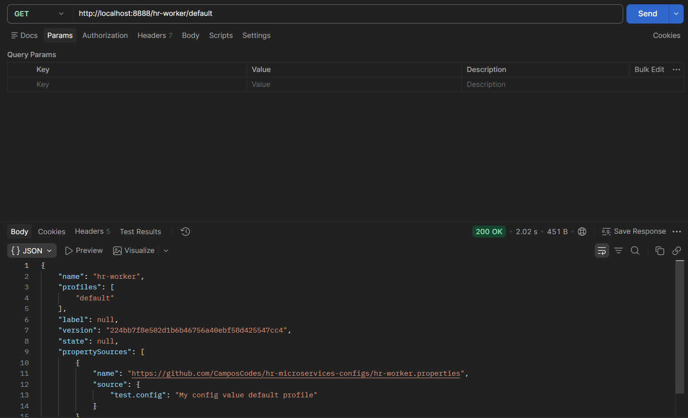
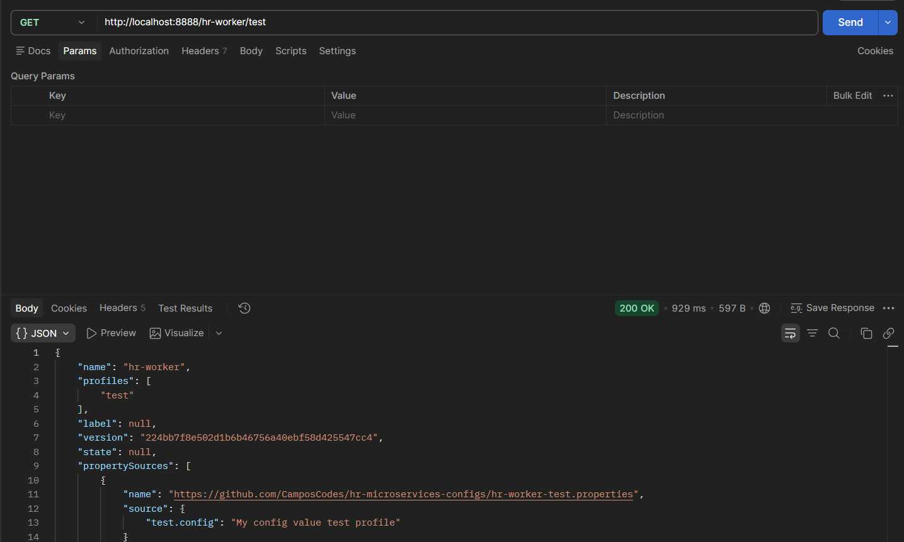

# 3.2 Configurar projeto hr-config-server

`@EnableConfigServer` na classe principal transforma a aplicação num servidor do Spring Cloud Config: ela passa a expor os endpoints que entregam as configurações lidas de um repositório Git.

```properties
spring.application.name=hr-config-server
spring.cloud.config.server.git.default-label=main
server.port=8888

spring.cloud.config.server.git.uri=https://github.com/CamposCodes/hr-microservices-configs
```

`server.port=8888` é a porta convencional do config server, e é fixa de propósito: os outros microsserviços precisam saber esse endereço antes de subir, já que buscam a configuração deles logo no start, antes de qualquer registro no Eureka.

`spring.cloud.config.server.git.uri` aponta pro repositório de configurações. Aqui é o meu próprio repo (`CamposCodes/hr-microservices-configs`), não o do curso, com os arquivos `.properties` por aplicação e por perfil.

`spring.cloud.config.server.git.default-label=main` é um ajuste necessário: o Spring Cloud Config assume `master` como branch padrão do repositório, e repositórios criados hoje no GitHub nascem com `main`. Sem essa linha o config server tenta buscar uma branch que não existe e não devolve configuração nenhuma.

O endpoint segue o padrão `/{aplicação}/{perfil}`, então dá pra testar a configuração de qualquer serviço direto no navegador ou no Postman, sem subir o serviço em si.

**GET `localhost:8888/hr-worker/default`:** 200 OK, com `propertySources` apontando pro arquivo `hr-worker.properties` do repositório de configs e a propriedade `test.config` valendo `"My config value default profile"`.



**GET `localhost:8888/hr-worker/test`:** 200 OK, agora com `hr-worker-test.properties` na frente da lista e `test.config` valendo `"My config value test profile"`. Mesma aplicação, perfil diferente, arquivo diferente: é isso que permite ter dev, test e prod com valores próprios sem tocar no código do microsserviço.



Nas duas respostas o campo `version` traz o hash do commit do repositório de configs que originou aquela resposta, ou seja, dá pra saber exatamente qual versão da configuração o serviço recebeu.

---

#### English

`@EnableConfigServer` on the main class turns the application into a Spring Cloud Config server: it starts exposing the endpoints that serve configuration read from a Git repository.

```properties
spring.application.name=hr-config-server
spring.cloud.config.server.git.default-label=main
server.port=8888

spring.cloud.config.server.git.uri=https://github.com/CamposCodes/hr-microservices-configs
```

`server.port=8888` is the config server's conventional port, and it is fixed on purpose: the other microservices need to know this address before they start, since they fetch their configuration right at startup, before any Eureka registration.

`spring.cloud.config.server.git.uri` points to the configuration repository. Here it is my own repo (`CamposCodes/hr-microservices-configs`), not the course's, with the `.properties` files per application and per profile.

`spring.cloud.config.server.git.default-label=main` is a needed adjustment: Spring Cloud Config assumes `master` as the repository's default branch, and repositories created today on GitHub start with `main`. Without this line the config server tries to fetch a branch that does not exist and returns no configuration at all.

The endpoint follows the `/{application}/{profile}` pattern, so any service's configuration can be tested straight from the browser or Postman, without starting the service itself.

**GET `localhost:8888/hr-worker/default`:** 200 OK, with `propertySources` pointing to the `hr-worker.properties` file in the configs repository and the `test.config` property holding `"My config value default profile"`.


**GET `localhost:8888/hr-worker/test`:** 200 OK, now with `hr-worker-test.properties` at the front of the list and `test.config` holding `"My config value test profile"`. Same application, different profile, different file: that is what allows having dev, test and prod with their own values without touching the microservice's code.


In both responses the `version` field carries the commit hash of the configs repository that produced that response, meaning it is possible to know exactly which version of the configuration the service received.
