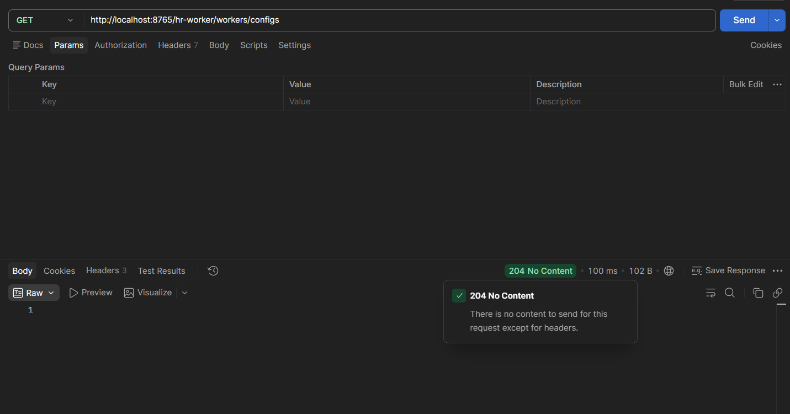

# 3.3 hr-worker como cliente do servidor de configuração, profiles ativos

Dependência `spring-cloud-starter-config` adicionada ao hr-worker: é ela que faz o serviço buscar configuração no hr-config-server antes de subir.

A configuração de cliente foi pro `bootstrap.properties`, arquivo novo, e não pro `application.properties`:

```properties
spring.application.name=hr-worker
spring.cloud.config.uri=http://localhost:8888

spring.profiles.active=test
```

O motivo é a ordem de carregamento. O Spring lê o `bootstrap.properties` num contexto anterior ao da aplicação, e é nesse momento que ele precisa saber três coisas: o nome da aplicação (que vira o `{aplicação}` na busca), o endereço do config server e o perfil ativo. Se isso estivesse no `application.properties`, seria tarde demais: o serviço já teria montado o contexto principal sem nunca ter perguntado nada pro config server.

`spring.profiles.active=test` é o que decide quais arquivos do repositório de configs o hr-worker recebe. Com o perfil `test`, ele puxa `hr-worker-test.properties` por cima de `hr-worker.properties`, o específico ganhando do comum.

O `application.properties` local continua existindo, com porta, Eureka e banco. Ou seja, nesta aula a configuração centralizada não substitui a local ainda, ela se soma: o serviço lê o que vem do config server e o que está no arquivo local.

Pra provar que a propriedade remota realmente chegou, o `WorkerController` ganhou um campo injetado e um endpoint:

```java
@Value("${test.config}")
private String testConfig;

@GetMapping(value="/configs")
public ResponseEntity<Void> config(){
    logger.info("config = " + testConfig);
    return ResponseEntity.noContent().build();
}
```

`test.config` não existe em nenhum properties local do hr-worker, só no repositório de configs. Isso torna o teste honesto: se o config server estiver fora do ar ou o perfil apontar pro arquivo errado, a injeção do `@Value` falha e o hr-worker nem sobe.

O endpoint devolve 204 No Content de propósito: ele não expõe o valor na resposta, só escreve no log do hr-worker, que com o perfil `test` ativo mostra o valor vindo de `hr-worker-test.properties`.

Testado pelo gateway em GET `localhost:8765/hr-worker/workers/configs`: 204 No Content em 100ms. Passar pelo gateway em vez de chamar o hr-worker direto testa a cadeia inteira de uma vez: Zuul roteia, Eureka resolve a instância, e o hr-worker que respondeu subiu com a configuração vinda do config server.



---

#### English

`spring-cloud-starter-config` dependency added to hr-worker: it is what makes the service fetch its configuration from hr-config-server before starting.

The client configuration went into `bootstrap.properties`, a new file, and not into `application.properties`:

```properties
spring.application.name=hr-worker
spring.cloud.config.uri=http://localhost:8888

spring.profiles.active=test
```

The reason is the loading order. Spring reads `bootstrap.properties` in a context that comes before the application's, and that is the moment it needs to know three things: the application name (which becomes the `{application}` in the lookup), the config server address and the active profile. If that lived in `application.properties`, it would be too late: the service would already have built its main context without ever asking the config server anything.

`spring.profiles.active=test` is what decides which files from the configs repository hr-worker receives. With the `test` profile, it pulls `hr-worker-test.properties` on top of `hr-worker.properties`, the specific one winning over the common one.

The local `application.properties` still exists, with port, Eureka and database. So in this lesson the centralized configuration does not replace the local one yet, it adds to it: the service reads both what comes from the config server and what is in the local file.

To prove the remote property actually arrived, `WorkerController` got an injected field and an endpoint:

```java
@Value("${test.config}")
private String testConfig;

@GetMapping(value="/configs")
public ResponseEntity<Void> config(){
    logger.info("config = " + testConfig);
    return ResponseEntity.noContent().build();
}
```

`test.config` does not exist in any local hr-worker properties file, only in the configs repository. That makes the test honest: if the config server is down or the profile points to the wrong file, the `@Value` injection fails and hr-worker does not even start.

The endpoint returns 204 No Content on purpose: it does not expose the value in the response, it only writes it to hr-worker's log, which with the `test` profile active shows the value coming from `hr-worker-test.properties`.

Tested through the gateway with GET `localhost:8765/hr-worker/workers/configs`: 204 No Content in 100ms. Going through the gateway instead of calling hr-worker directly tests the whole chain at once: Zuul routes, Eureka resolves the instance, and the hr-worker that answered started up with the configuration coming from the config server.


